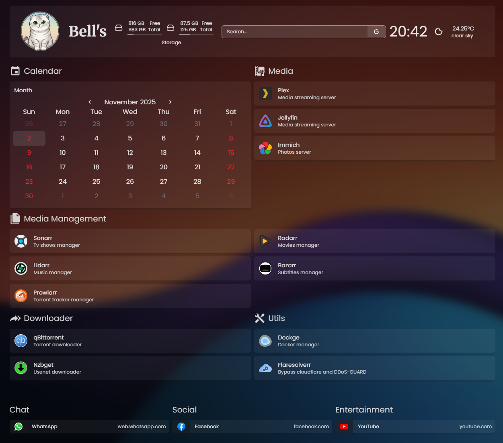

# Homepage Setup Guide


## Overview

Homepage is a web-based dashboard that provides an overview of your media server: showing system stats, disks, connected services, weather, and shortcuts to your containers. It's highly customizable and serves as a dashboard for monitoring your server.



**Official Homepage:** [Homepage](https://gethomepage.dev/)

## Configuration

### 1. Update `compose.yaml`

- `path/to/icons` is optional variable, to displaying your own icons.
- `path/to/data` is optional variable, to displaying stats of disk data usage.

### 2. Update `.env`

```
PUID=<your-user-id>                 # User ID for file ownership
PGID=<your-group-id>                # Group ID for file ownership
TZ=<your-timezone>                  # e.g., Europe/London
HOMEPAGE_ALLOWED_HOSTS=<your-ip>    # 127.0.0.1 or *
HOMEPAGE_VAR_WEATHER=<you-api-key>  # openweathermap api key
```

- You can find your `PUID` and `PGID` with:

```bash
id $USER
```

- Find your timezone `TZ`, from the [TZ Database List](https://en.wikipedia.org/wiki/List_of_tz_database_time_zones).

- For `HOMEPAGE_ALLOWED_HOSTS` Use `*` for LAN access or specify your devices `ip` explicitly in.

- Usage of `HOMEPAGE_VAR_WEATHER` is optional for showing weather information, i used [openweathermap](https://openweathermap.org) API.

## Deployment

1. Change to container directory:

```bash
cd ~/media_server/homepage
```

2. Run the container:

```bash
docker compose up -d
```

3. Access Homepage in your browser:

```
http://<your-server-ip>:3000
```
